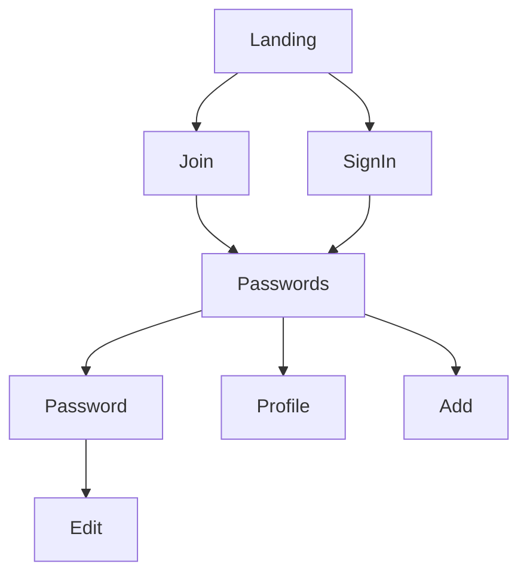
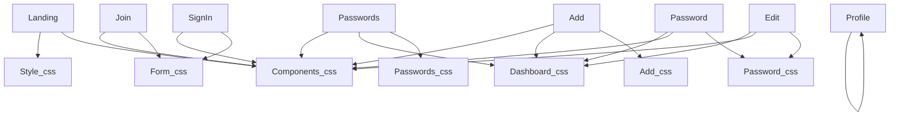

ToDo :
- Complete Templates
- Gestion des Cookies
- Add Account 
- Research Bar

Figma Mockup : https://www.figma.com/file/OfFoygX4mveoUvWu0yLGRW/Gestionnaire-MDP?node-id=0%3A1&t=Nrlzhu0X12f7TmdR-1

Website Map : 

Page dependencies : 

Issues : 
- Get Started Button, Landing Page
